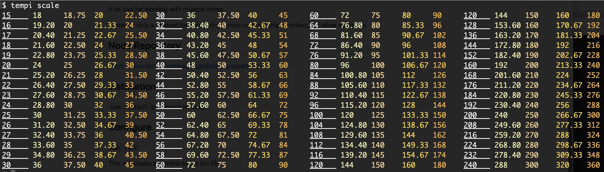

# tempi

A cli tool for working with musical tempi.

Currently only a method for generating tempo scales is implemented, but others will follow.

## Node Repository

https://www.npmjs.com/package/tempi

## Installation

`npm install tempi`

## Configure

`npm link`

This will create a symlink to the bin file.

Make sure you have a PATH to bin set in your shell configuration.

## help

`$ tempi help`

`$ tempi help scale`

## screenshot

